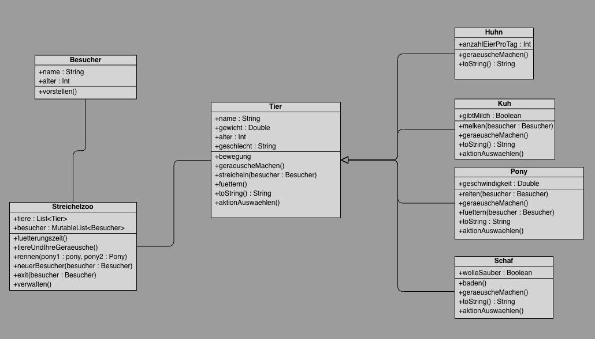

<h1 align="center">Grundlagen der Programmierung</h1>
<h3 align="center">Objektorientierte Programmierung</h3>

  

**Beschreibung:**

Diese Aufgabe ist eine spezielle Coding Challenge, die an Challenges angelehnt ist, welche später in Bewerbungsprozessen auf dich zukommen können.

**Hinweise zur Bearbeitung:**

- Achte auf einen sauberen Quellcode, insbesondere Einrückungen sind wichtig!
- Bevor ihr zur nächsten Klasse/Datei weiter geht, testet euren Code! Er sollte korrekt kompilieren und ausführen
- Bei manchen Aufgaben hat man die Wahl, sich den Hinweis anzuschauen oder nicht.
- Bitte commite und pushe am Ende des Tages unbedingt dein Projekt zu Github.

Erstelle deine Klassen anhand folgendem Klassendiagramm: 

**Beachte außerdem folgendes:**
- Für weitere Informationen zu den einzelnen Klassen findest du unten die Reiter zu den einzelnen Klassen
- Jede Klasse soll in eine eigene Datei. 

---

 <b> Besucher </b> 

- Erstelle eine neue Datei, in der du die Klasse schreibst
- Die Klasse soll folgende **Attribute** besitzen:
    - Alter
    - Name
- Ausserdem soll sie eine **Methode** besitzen, die den Namen des Besuchers zusammen mit einer Begrüßung auf der Konsole ausgibt
  - Die Ausgabe kann z.B. wie folgt aussehen: `Hallo, mein Name ist Jack Black!`

**TEST:**
Erstelle zum Testen der Klasse eine Instanz der Klasse in der Datei `Main.kt` und rufe ihre Methode auf

---

<b>Tier</b>

- Erstelle eine neue Datei, in der du die Klasse schreibst
- Die Klasse soll folgende **Attribute** besitzen:
  - Name
  - Gewicht
  - Alter
  - Geschlecht
- Und folgende **Methoden**:
  - bewegung(): Ein Tier kann sich bewegen. Dabei wird in der Konsole ausgegeben, dass sich das Tier bewegt hat.
  - geraeuscheMachen(): Ein Tier kann Geräusche machen. Dabei wird in der Konsole ausgegeben, dass das Tier Geräusche gemacht hat. Die Methode hierfür ist überschreibbar.
  - streicheln(): Ein Tier kann gestreichelt werden. Die Methode hierfür erhält als Parameter einen Besucher. In der Konsole wird dann ausgegeben, welches Tier von welchem Besucher gestreichelt wurde.
  - fuettern(): Ein Tier kann von einem Besucher gefüttert werden. Die Methode hierfür erhält als Parameter einen Besucher. In der Konsole wird dann ausgegeben, welches Tier von welchem Besucher gefüttert wurde. Zusätzlich erhöht sich das Gewicht des Tieres um 2%.
  - aktionAuswaehlen() : Von dieser Methode sollen andere Tiere erben können. Sie wird für die spätere Aufgabe "Interaktion mit dem Streichelzoo" gebraucht. Lass sie zunächst leer.

**TEST:**
Erstelle zum Testen der Klasse eine Instanz dieser in der Datei `Main.kt` und rufe ihre Methoden auf

---

<b>Schaf</b>

- Erstelle eine neue Datei, in der du die Klasse schreibst
- Die Klasse `Schaf` erbt von der Klasse `Tier`
- Die Klasse soll folgende **Attribute** besitzen:
  - Name
  - Gewicht
  - Alter
  - Geschlecht
  - WolleSauber
- Und folgende **Methoden**:
  - Die Klasse soll die Funktion, geraeuscheMachen() der Mutterklasse überschreiben und "määäh" auf der Konsole ausgeben
  - baden(): Diese Funktion soll die Wolle des Schafes sauber machen
  - fuettern()
  - streicheln()
  - bewegung()
  - aktionAuswaehlen()

**TEST:**
Erstelle zum Testen der Klasse eine Instanz dieser in der Datei `Main.kt` und rufe ihre Methoden auf

Hinweis

Achte darauf, welche Attribute bereits von der Mutterklasse an die Kindklasse vererbt werden

---

<b>Kuh</b>

- Erstelle eine neue Datei, in der du die Klasse schreibst
- Die Klasse `Kuh` erbt von der Klasse `Tier`
- Die Klasse soll folgende **Attribute** besitzen:
  - Name
  - Gewicht
  - Alter
  - Geschlecht
  - GibtMilch: Kuh gibt Milch, wenn sie min. 3 Jahre alt und weiblich ist
    -> schreibe für diese eine **sekundären Konstruktor** oder nutze einen **init-Block**
- Und folgende **Methoden**:
  - Die Klasse soll die Funktion, geraeuscheMachen() der Mutterklasse überschreiben und "Muuuuhh" auf der Konsole ausgibt
  - Eine Funktion melken(), bekommt einen Besucher übergeben und gibt auf der Konsole aus, ob die Kuh Milch gibt oder nicht
  - fuettern()
  - streicheln()
  - bewegung()
  - aktionAuswaehlen()

**TEST:**
Erstelle zum Testen der Klasse eine Instanz dieser in der Datei `Main.kt` und rufe alle ihre Methoden auf

Hinweis

- Achte darauf, welche Methoden und Attribute bereits von der Mutterklasse an die Kindklasse vererbt werden

---

<b>Huhn</b>

- Erstelle eine neue Datei, in der du die Klasse schreibst
- Die Klasse `Huhn` erbt von der Klasse `Tier`
- Die Klasse soll folgende **Attribute** besitzen:
  - Name
  - Gewicht
  - Alter
  - Geschlecht
  - AnzahlEierProTag: Dieses Attribut soll bei männlichen Hühnern immer mit 0 initialisiert werden und sonst mit einem Zufallswert zwischen 1 und 3.
- Und folgende **Methoden**:
  - Die Klasse soll die Funktion, geraeuscheMachen() der Mutterklasse überschreiben und "ga-gack" auf der Konsole ausgeben
  - fuettern()
  - streicheln()
  - bewegung()

**TEST:**
Erstelle zum Testen der Klasse eine Instanz dieser in der Datei `Main.kt` und rufe alle ihre Methoden und gebe auch die
Anzahl der Eier pro Tag aus

Hinweis

- Achte darauf, welche Methoden und Attribute bereits von der Mutterklasse an die Kindklasse vererbt werden.
- **Nutze für AnzahlEierProTag den sekundären Konstruktor oder einen init-Block!**

---

<b>Pony</b>

- Erstelle eine neue Datei, in der du die Klasse schreibst
- Die Klasse `Pony` erbt von der Klasse `Tier`
- Die Klasse soll folgende **Attribute** besitzen:
  - Name
  - Gewicht
  - Alter
  - Geschlecht
  - Geschwindigkeit
- Und folgende **Methoden**:
  - Die Klasse soll die Funktion, geraeuscheMachen() der Mutterklasse überschreiben und "Wiehhiehie" auf der Konsole ausgibt
  - fuettern() soll überschrieben werden. Sodass, das Pony sich entscheiden kann, ob es lieber Zucker oder eine Karotte will.
    Diese Entscheidung soll random sein und es soll auf der Konsole ausgegeben werden, welcher Besucher das Pony womit gefüttert hat.
  - streicheln()
  - bewegung()
  - Die Funktion reiten() soll einem Besucher erlauben auf dem Pony zu reiten, wenn das Pony älter als 1 Jahr ist und der Besucher min. 6 Jahre alt ist.
    In jedem Fall soll die Funktion eine passende Meldung mit der Geschwindigkeit ausgeben.
  - aktionAuswaehlen()

**TEST:**
Erstelle zum Testen der Klasse eine Instanz dieser in der Datei `Main.kt` und rufe alle ihre Methoden auf

Hinweis

Achte darauf, welche Methoden und Attribute bereits von der Mutterklasse an die Kindklasse vererbt werden!

---

<b>Streichelzoo</b>

Jetzt erstellen wir unseren Streichelzoo. Dazu erstellst du eine Klasse mit dem Namen **Streichelzoo**.

Die Klasse hat zum einen eine Eigenschaft `tiere` Eigenschaft, eine List vom Typ Tier. In dieser Liste werden alle Tiere aufbewahrt.
Die Liste wird in der Klasse initialisiert mit min. folgenden Tieren:
- 2 Schafe
- 2 Hühner
- 1 Kuh
- 2 Ponys

Außerdem hat der Streichelzoo die Eigenschaft `besucher` : Dies ist eine MutableList, die die Besucher im Streichelzoo darstellt.
Es können nur maximal 5 Besucher gleichzeitig im Streichelzoo sein und diese ist bei der Initialisierung immer leer.

folgende Methoden werden für das Besuchermanagement benötigt:
- neuerBesucher(): der Besucher stellt sich innerhalb dieser Methode vor und wird eingelassen, falls weniger als 5 Besucher bisher
  im Streichelzoo sind. Die Funktion gibt eine passende Nachricht auf der Konsole aus
- exit(): Diese Methode bekommt einen Besucher übergeben, der dann den Streichelzoo verlässt.

Der Streichelzoo bietet verschiedene Interaktionen an.

-  tiereUndIhreGeräusche(): Die Tiere freuen sich immer, wenn ein Besucher den Streichelzoo betritt. Dann machen alle Tiere Geräusche.
   Verwende eine Schleife, um alle Tiergeräusche auszugeben und rufe sie an passender Stelle in der Datei auf,
   sodass die Tiere immer Geräusche machen, wenn ein neuer Besucher eintritt. Diese Methode soll nicht von außerhalb aufgerufen werden können.
-  rennen(): Der Zoo bietet ein Rennen zwischen zwei Ponys an. Schreibe eine Methode, bei der zwei Ponys als Parameter übergeben werden
   und das Schnellere der zwei in der Konsole als Gewinner ausgegeben wird.
- verwalten(): Diese Methode wird für die Aufgabe "Interaktion mit dem Streichelzoo" benötigt. Lass diese Methode zunächst leer

**TEST:**
Erstelle zum Testen der Klasse eine Instanz dieser in der Datei `Main.kt` und rufe alle ihre Methoden auf

---

<b>Ein Tag im Streichelzoo</b>

Erstellt eine Datei Tag.kt mit einer main()-Funktion. Erstelle zusätzlich min. 6 Besucher

Lass die Besucher den Tagesablauf durchführen und benutze, wenn immer möglich, eine Schleife:

1. Jeder der Besucher versucht in den Streichelzoo zu gehen.
4. Alle Besucher wollen zuerst auf einem der Ponys reiten.
5. Ein Besucher füttert das Schaf.
5. Eines der Hühner läuft durchs Gehege.
6. Ein paar Besucher streicheln die Kuh
7. 2 Besucher verlassend den Streichelzoo
9. Ein Besucher versucht die Kuh zu melken.
11. Fütterungszeit. Ein Besucher füttert alle Tiere
13. Ein Zoowärter kontrolliert alle Schafe, ob sie sauber sind. Wäscht die dreckigen.
14. Zuletzt haben die beiden Ponys ein Rennen.
15.  Die restlichen Besucher verlassen den Zoo

---

<b>Interaktion mit dem Streichelzoo</b>

Erstelle eine Datei InteraktiverTag.kt In dieser Datei sollst du nun drei Funktionen implementieren:
1. tierErstellen() : Diese Funktion soll Usern die Möglichkeit geben, ein Tier mithilfe von readln()- Befehlen zu erstellen. Frage dafür zunächst welche Art von Tier erstellt werden soll und speichere die Antwort ab. Dies sollst du für alle nötigen Eigenschaften der Tiere machen und am Ende ein Tier erstellen und dann zurückgeben.
2. besucherErstellen() : Diese Funktion soll uns die Möglichkeit, Besucher mittels Eingaben auf der Kommandozeile zu erstellen. Frage nach allen nötigen Eigenschaften, erstelle dann eine Instanz von Besucher und gib diese zurück
3. main() : In der main-Funktion sollst du nun mit der tierErstellen()-Funktion mindestens eine Instanz von jeder Unterklasse von Tier erstellen. Füge diese alle in einer Liste zusammen. Erstelle dann eine Instanz von Streichelzoo und übergib diesem die neue Liste von Tieren.

Jetzt wird es Zeit, die aktionAuswählen-Methode in unseren Tieren zu füllen. In dieser soll einmal eine Auswahl mit allen möglichen Methoden des jeweiligen Tieres ausgegeben werden. User*innen können dann eine davon auswählen und diese soll asugeführt werden. Wenn eine Methode einen Besucher als Argument benötigt, soll dieser mit Hilfe der besucherErstellen-Funktion erstellt werden.

Nun sollst du die verwalten-Methode vom Streichelzoo schreiben. Diese soll alle Tiere im Zoo auflisten. Aus dieser Auswahl soll man ein Tier wählen und dann die aktionAuswahl-Methode nutzen können. Das soll solange wiederholt werden, bis der Nutzer das Program beenden will.

Zuletzt sollst du nun in der main-Funktion die verwalten-Methode auf deiner Instanz von Streichelzoo ausführen.

---

<b>Coding Interview Fragen</b>

Beantworte folgende Fragen. Erstelle dafür eine Datei `Antworten.txt` und schreibe deine Antworten hier rein.  
> Die Fragen könnten so in einem Bewerbungsverfahren abgefragt werden. Nimm dir daher etwas Zeit und beantworte die Fragen selbstständig. Gerne kannst du dich hierfür nochmal in den Vorlesungsfolien oder in eigener Recherche informieren.

1. **Was ist eine Klasse und wozu braucht man Klassen?**
2. **Erkläre anhand eines Beispiels wie Vererbung funktioniert**
3. **Was ist der Unterschied zwischen Wert- und Referenztypen?**
4. **Kann ich in folgenden Fällen Werte hinzufügen/entfernen oder verändern? Warum?**
    1. `var zahlen = mutableListOf(1,2,3)`
    2. `var zahlen = listOf(1,2,3)`
    3. `val zahlen = mutableListOf(1,2,3)`
    4. `val zahlen = listOf(1,2,3)`

---

<b>Bonusaufgabe</b>

Unser heutiges Projekt sollte euch als Inspiration dienen, selbstständig weiteren Code zum Üben zu programmieren.

Statt weiteren Bonusaufgaben gibt es also Vorschläge für weitere Features, die ihr freiwillig noch im Projekt einbauen könnt.

Sie sind offen geschrieben, es gibt also viele Lösungsmöglichkeiten. Versuche sie so gut wie möglich umzusetzen.

1. **Futterbeutel**

- Um Tiere zu füttern, brauchen wir natürlich Futter. Erstelle einen Futterbeutel. Der Beutel enthält Futter, angegeben in Gramm. Jeder Besucher hat einen Futterbeutel. Der Besucher kann jetzt das Futter zum Füttern verwenden. Dabei steigt das Gewicht des Tieres, je nachdem wie viel Futter verfüttert wurde. Das verfütterte Futter verschwindet natürlich aus dem Futterbeutel.

- Der Besucher kann den Futterbeutel an einer Kasse wieder auffüllen. Dafür muss der Besucher Geld bezahlen. Erweitere die Besucher-Klasse, sodass ein Besucher nun auch Geld mit sich trägt. Das Startgeld kann zu Beginn zufällig zugewiesen werden.

1. **Fütterung**

- Jedes Tier mag anderes Futter. Erstelle verschiedene Sorten an Futter. Bei der Kasse kann der Besucher sie zu unterschiedlichen Preisen kaufen und im Futterbeutel aufbewahrt werden.

- Die Kasse hat auch ein Infoblatt. In dem Infoblatt steht, welches Tier welches Futter mag. Die Tiere sind jetzt auch wählerisch und fressen kein Futter, das sie nicht mögen.

1. **Patenschaft**

- An der Kasse gibt es die Möglichkeit, eine Patenschaft mit einem Tier einzugehen.

Im Infoblatt ist aufgelistet, welches Tier wie viel kostet.

Zusätzlich wird an der Kasse aufgelistet, welches Tier welche Besucher als Paten hat.

---
